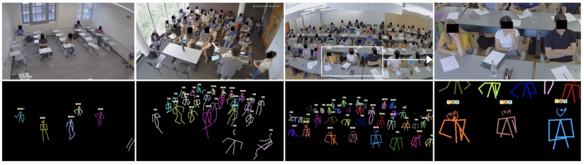
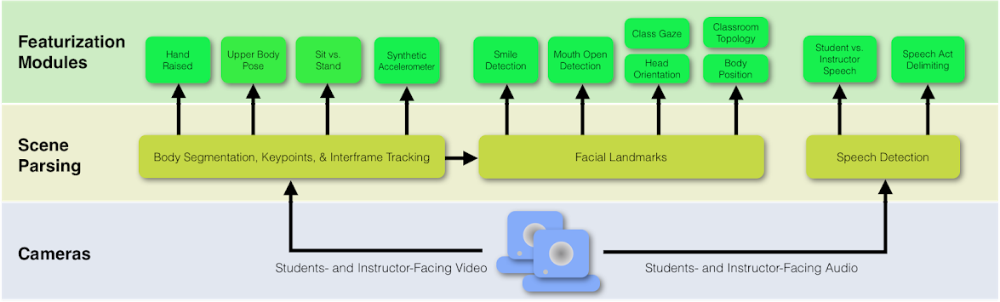
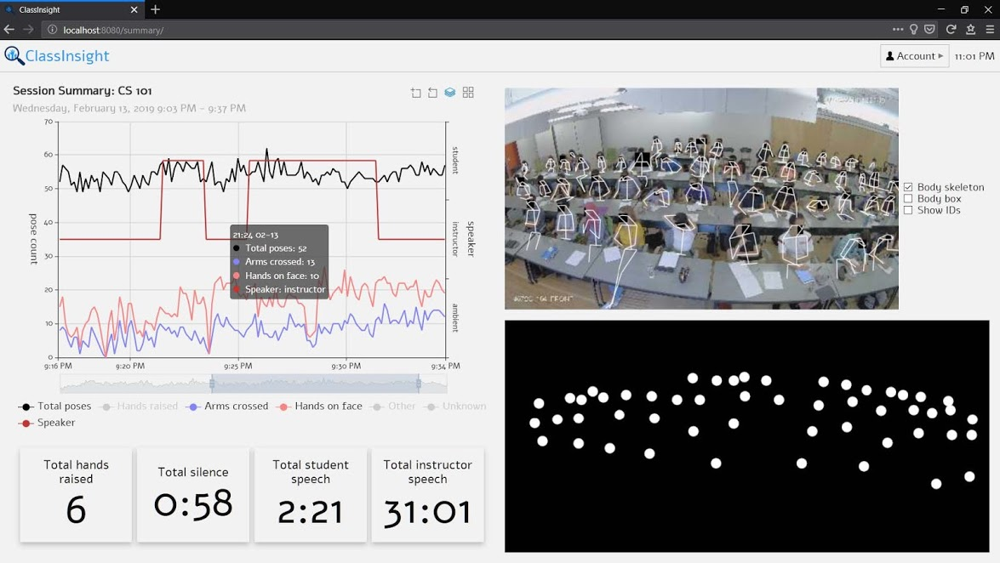
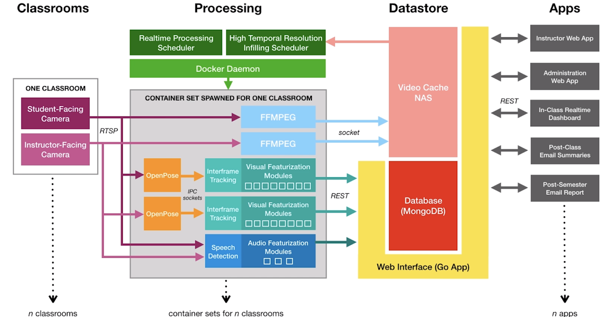

# EduSense: Practical Classroom Sensing at Scale



[EduSense](https://www.edusense.io/) represents the **first real-time, in-the-wild evaluated and practically-deployable  classroom sensing system at scale** that produces a plethora of theoretically-motivated visual and audio features correlated with effective instruction.

Our [getting started](doc/getting_started.md) is a good starting point if you are interested in building/developing/deploying EduSense. More information about the team can be found on the [EduSense website](https://www.edusense.io/team).

## News

- *Oct 2019* We open-source our EduSense code!
- *Sep 2019* We presented our paper titled "Edusense: Practical Classroom Sensing at Scale" at Ubicomp'19.

## Features for Students and Instructors

- **Visual Features**:
    - **Body Segmentation, Keypoints and Inter-frame tracking**:
        - Hand Raise Detection
        - Upper Body Pose Estimation
        - Sit vs Stand Detection
        - Synthetic Accelerometer
        - Classroom Topology
    - **Facial Lanndmarks and Attributes**:
        - Smile Detection
        - Mouth State Detection
        - Gaze Estimation
- **Audio Features**:
    - **Speech Detection**:        
        - Student vs Instructor Speech
        - Speech Act Delimation   

### Visualization Dashboard



### System Architecture


## Related Links
- [EduSense Website](https://www.edusense.io/)
- [EduSense Paper](https://karan-ahuja.com/assets/docs/paper/edusense.pdf)
- [EduSense Docker Hub](https://hub.docker.com/u/edusensecmu)

## Citation

Karan Ahuja, Dohyun Kim, Franceska Xhakaj, Virag Varga, Anne Xie, Stanley Zhang, Jay Eric Townsend, Chris Harrison, Amy Ogan, and Yuvraj Agarwal. 2019. EduSense: Practical Classroom Sensing at Scale. Proc. ACM Interact. Mob. Wearable Ubiquitous Technol. 3, 3, Article 71 (September 2019), 26 pages. DOI: https://doi.org/10.1145/3351229

```
@article{Ahuja:2019:EPC:3361560.3351229,
 author = {Ahuja, Karan and Kim, Dohyun and Xhakaj, Franceska and Varga, Virag and Xie, Anne and Zhang, Stanley and Townsend, Jay Eric and Harrison, Chris and Ogan, Amy and Agarwal, Yuvraj},
 title = {EduSense: Practical Classroom Sensing at Scale},
 journal = {Proc. ACM Interact. Mob. Wearable Ubiquitous Technol.},
 issue_date = {September 2019},
 volume = {3},
 number = {3},
 month = sep,
 year = {2019},
 issn = {2474-9567},
 pages = {71:1--71:26},
 articleno = {71},
 numpages = {26},
 url = {http://doi.acm.org/10.1145/3351229},
 doi = {10.1145/3351229},
 acmid = {3351229},
 publisher = {ACM},
 address = {New York, NY, USA},
 keywords = {Audio, Classroom, Computer Vision, Instructor, Machine Learning, Pedagogy, Sensing, Speech Detection, Teacher},
}
```

## License

The source code in this directory and its subdirectories are all governed
by [BSD 3-Clause License](/LICENSE) unless otherwise noted in the source code.
Once compiled or packaged, it is the user's reponsibility to ensure that any
use of the result binary or image complies with any relevant licenses for all
software packaged together.
